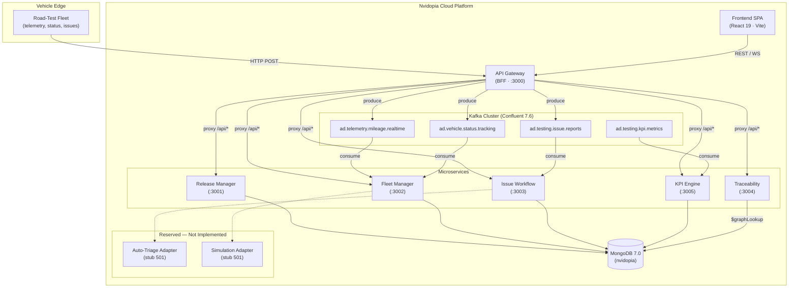
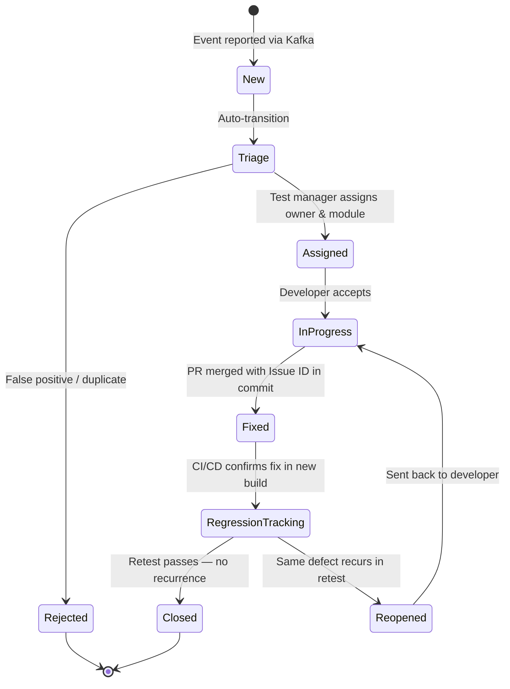

# Nvidopia — Architecture Document

## 1. System Overview

Nvidopia is an **Autonomous Driving (AD) Software Iteration Optimization Platform** — a microservice-based middleware system that manages the full lifecycle of road-test campaigns for self-driving vehicles. It covers **Project / Task / Run / Issue** entity management, a strict Issue state-machine workflow, real-time KPI dashboards (Dashboard-as-Code), and bidirectional traceability graphs that satisfy ASPICE / ISO 26262 compliance requirements.

The platform ingests high-throughput vehicle telemetry through Apache Kafka, processes it across purpose-built microservices, persists structured metadata in MongoDB, and exposes a React single-page application for project managers, test engineers, and development leads.

---

## 2. Architecture Diagram



---

## 3. Technology Stack

| Layer | Technology | Version / Notes |
|-------|-----------|-----------------|
| **Frontend** | React + TypeScript + Vite | React 19, Vite 6, react-router-dom 7 |
| **UI Libraries** | TanStack Query, Recharts, Lucide React, clsx | Data fetching, charting, icons |
| **API Gateway** | Node.js + Express | kafkajs (producer), http-proxy-middleware |
| **Microservices** | Node.js + Express + Mongoose + kafkajs | TypeScript, tsx hot-reload |
| **Database** | MongoDB | 7.0 (document store + `$graphLookup`) |
| **Message Broker** | Apache Kafka | Confluent Platform 7.6 (cp-kafka image) |
| **Observability** | Pino logger, OpenTelemetry (reserved) | `@nvidopia/observability` package |
| **API Contracts** | OpenAPI 3.x + AsyncAPI | Spectral lint, openapi-generator-cli |
| **Containerization** | Docker + Docker Compose | `infra/docker-compose.yml` |
| **Package Management** | npm workspaces | Monorepo with `apps/*`, `services/*`, `platform/*`, `contracts` |

---

## 4. Service Catalog

| Service | Package | Port | Responsibility | Kafka Topics |
|---------|---------|------|---------------|--------------|
| **BFF Gateway** | `@nvidopia/bff-gateway` | 3000 | JWT auth, request routing, protocol adaptation (HTTP → Kafka produce), rate limiting | Produces: `ad.telemetry.mileage.realtime`, `ad.vehicle.status.tracking`, `ad.testing.issue.reports` |
| **Release Manager** | `@nvidopia/release-manager` | 3001 | Project & Task CRUD, multi-stage release gates (Smoke → Gray → Freeze → Go-Live) | — |
| **Fleet Manager** | `@nvidopia/fleet-manager` | 3002 | Vehicle resource pool, Task-vehicle matching, Run lifecycle, mileage aggregation | Consumes: `ad.telemetry.mileage.realtime`, `ad.vehicle.status.tracking` |
| **Issue Workflow** | `@nvidopia/issue-workflow` | 3003 | Issue creation from Kafka events, state-machine enforcement, triage, audit log | Consumes: `ad.testing.issue.reports` |
| **Traceability** | `@nvidopia/traceability` | 3004 | Forward & backward traceability via `$graphLookup`, coverage stats, compliance reports | — |
| **KPI Engine** | `@nvidopia/kpi-engine` | 3005 | KPI metric consumption & query (MPI, MTTR, regression rate, fleet utilization, convergence) | Consumes: `ad.testing.kpi.metrics` |
| **Frontend** | `@nvidopia/frontend` | 5173 (dev) | SPA — project/task/run/issue views, Dashboard-as-Code renderer, traceability visualization | — |

### Platform Libraries (not standalone services)

| Package | Purpose |
|---------|---------|
| `@nvidopia/data-models` | Shared Mongoose schemas (Project, Task, Run, Issue, Requirement, Commit, Build, Vehicle, KpiSnapshot) |
| `@nvidopia/eventing` | Kafka topic constants, producer/consumer utilities, DLQ helpers, topic setup script |
| `@nvidopia/observability` | Structured logging (Pino), trace-ID propagation |
| `@nvidopia/contracts` | OpenAPI specs, AsyncAPI specs, JSON Schema, generated typed clients |

---

## 5. Data Model Overview

The platform is built around **four core domain entities** arranged in a strict parent-child hierarchy:

```
Project  (top-level test campaign)
  └── Task  (executable unit: Daily / Smoke / Gray / Freeze / Retest)
        └── Run  (physical test execution — one vehicle, one time window)
              └── Issue  (defect / anomaly captured during a Run)
```

### Entity Relationship Summary

| Entity | Key Fields | Parent | Collections |
|--------|-----------|--------|-------------|
| **Project** | `project_id`, vehicle platform, SoC architecture, sensor suite, baseline SW version, target mileage | — | `projects` |
| **Task** | `task_id`, type (`Daily`/`Smoke`/`Gray`/`Freeze`/`Retest`), priority, target vehicle count, status | Project | `tasks` |
| **Run** | `run_id`, VIN, driver/safety-operator ID, start/end time, AD mileage, SW/HW heartbeat version | Task | `runs` |
| **Issue** | `issue_id`, timestamp, GPS coordinates, category (perception/prediction/planning/chassis), severity, takeover type, snapshot URL, triage status | Run | `issues` |

### Supporting Entities (Traceability Graph)

| Entity | Collection | Purpose |
|--------|-----------|---------|
| Requirement | `requirements` | External safety requirements (ASIL level, description) |
| Commit | `commits` | Code changes linked to Issues and Requirements |
| Build | `builds` | Software build artifacts (version tag, hash) |
| Vehicle | `vehicles` | Real-time vehicle state cache |
| KpiSnapshot | `kpi_snapshots` | Persisted metric data points |
| IssueStateTransition | `issue_state_transitions` | Audit trail for every Issue status change |

---

## 6. Issue State Machine



### Transition Rules

| From | To | Trigger / Precondition |
|------|----|----------------------|
| New | Triage | Automatic upon Issue creation |
| Triage | Assigned | Test manager selects responsible module & assignee |
| Triage | Rejected | Marked as false-positive, duplicate, or driver error |
| Assigned | InProgress | Developer acknowledges and begins work |
| InProgress | Fixed | Code merged; commit references the Issue ID |
| Fixed | RegressionTracking | Build containing fix is deployed to test fleet |
| RegressionTracking | Closed | Physical retest confirms fix — QA signs off |
| RegressionTracking | Reopened | Defect recurs during retest |
| Reopened | InProgress | Returned to developer for re-investigation |

---

## 7. Kafka Topics

| Topic | Partition Key | Retention | Purpose |
|-------|--------------|-----------|---------|
| `ad.telemetry.mileage.realtime` | `vehicle_id` | 7 days | Per-second GPS, speed, mileage deltas from each vehicle |
| `ad.vehicle.status.tracking` | `vehicle_id` | Log Compaction | Heartbeat, SW/HW version, fuel/battery, driving mode (keeps latest per key) |
| `ad.testing.issue.reports` | `run_id` | 30 days | Structured defect payloads with snapshot URIs, fault codes, context |
| `ad.testing.kpi.metrics` | `project_id` | 7 days | Pre-aggregated KPI metrics (MPI, MTTR, regression rate, etc.) |
| `*.dlq` (per-topic) | original key | 30 days | Dead-letter queue for messages that fail after 3 retries |

Topic naming convention: `<domain>.<subdomain>.<business>.<characteristic>`

---

## 8. API Overview

All frontend traffic flows through the **BFF Gateway** (`/api/*`), which reverse-proxies to individual microservices.

### Release Manager (`:3001`)

| Method | Path | Description |
|--------|------|-------------|
| GET | `/api/projects` | List projects (paginated, filterable) |
| POST | `/api/projects` | Create project |
| GET | `/api/projects/:id` | Get project detail |
| PUT | `/api/projects/:id` | Update project |
| GET | `/api/projects/:id/tasks` | List tasks under a project |
| POST | `/api/tasks` | Create task |
| GET | `/api/tasks/:id` | Get task detail |
| PATCH | `/api/tasks/:id/status` | Advance task through release gates |

### Fleet Manager (`:3002`)

| Method | Path | Description |
|--------|------|-------------|
| GET | `/api/vehicles` | List vehicles with real-time status |
| GET | `/api/vehicles/:vin` | Get vehicle detail |
| POST | `/api/runs` | Create a Run (assign vehicle to task) |
| GET | `/api/runs` | List runs (filter by task, VIN, time range) |
| GET | `/api/runs/:id` | Get run detail |
| PATCH | `/api/runs/:id/status` | Update run lifecycle status |

### Issue Workflow (`:3003`)

| Method | Path | Description |
|--------|------|-------------|
| GET | `/api/issues` | List issues (paginated, filterable by status/severity) |
| GET | `/api/issues/:id` | Get issue detail |
| PATCH | `/api/issues/:id/transition` | Trigger state-machine transition |
| PATCH | `/api/issues/:id/assign` | Triage — assign owner & module |
| POST | `/api/issues/:id/link-commit` | Associate a fix commit |
| POST | `/api/auto-triage` | **Reserved** — returns 501 |

### Traceability (`:3004`)

| Method | Path | Description |
|--------|------|-------------|
| GET | `/api/trace/forward/:requirementId` | Forward trace: Requirement → ... → Run/Issue |
| GET | `/api/trace/backward/:issueId` | Backward trace: Issue → ... → Requirement |
| GET | `/api/trace/impact/:issueId` | Impact spread: Issue → Commit → Requirement → affected Tasks |
| GET | `/api/trace/coverage/:projectId` | Requirement verification coverage percentage |

### KPI Engine (`:3005`)

| Method | Path | Description |
|--------|------|-------------|
| GET | `/api/kpi/mpi` | Miles Per Intervention (filterable by project, task type, time) |
| GET | `/api/kpi/mttr` | Mean Time To Resolution |
| GET | `/api/kpi/regression-rate` | Regression test pass rate |
| GET | `/api/kpi/fleet-utilization` | Fleet time utilization ratio |
| GET | `/api/kpi/convergence` | Issue convergence trend (time-series) |

---

## 9. Traceability Graph

The traceability service leverages MongoDB `$graphLookup` to perform recursive graph traversals across collections without a dedicated graph database.

### Forward Traceability (proving "what we promised was built and tested")

```
Requirement → Commit → Build → Project → Task → Run → Issue (verification result)
```

### Backward Traceability (proving "every crash traces back to a requirement")

```
Issue → Run → Task → Project → Build → Commit → Requirement
```

### Impact Spread Query

Starting from an Issue, the system walks backward to the originating Commit, finds all linked Requirements, then walks forward to discover every Task and Run that may be affected — enabling rapid change-impact analysis.

### Implementation

1. `$match` — target the starting entity (e.g., a specific Issue)
2. `$graphLookup` — recursively traverse upward through `run_id` → `task_id` → `project_id`
3. `$lookup` — join to the `commits` collection via `fix_commit_id` / `origin_commit_id`
4. `$graphLookup` — follow the commit's external ticket reference to the `requirements` collection

All collections maintain explicit parent-reference fields (`project_id`, `task_id`, `run_id`, `commit_id`) that serve as the graph edges.

---

## 10. Reserved Extension Points

| Capability | Current State | Extension Path |
|-----------|--------------|----------------|
| **Auto-Triage** | Stub interface returning 501 Not Implemented | Plug in a rule engine or ML classification service behind the `POST /api/auto-triage` endpoint. Fields `triage_mode`, `triage_hint`, `triage_source` on the Issue model are pre-allocated. |
| **Simulation Testing** | Reserved fields `simulation_ref` / `simulation_status` on Run model | Integrate a simulation orchestrator that creates virtual Runs, writes results back via the same Kafka pipeline, and populates the reserved fields. |
